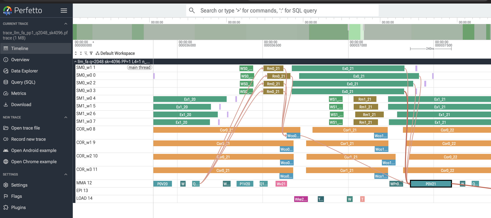

# llm_fa — FlashAttention forward for NVIDIA B200 (sm_100a)

> Every file in this repo — the CUDA kernels, the Python launchers, the
> bench/validate/trace harnesses, the trace-builder subagent, and this
> README — was produced by prompting [Claude Code](https://claude.com/claude-code).

A C++/inline-PTX implementation of FlashAttention forward (BF16, head_dim=128,
non-causal). On a B200 at NCU-locked clocks, **`llm_fa` trails the stock
CuTeDSL FA4 reference by ~160 ns per main-loop iteration (ratio 0.94)** at
single-wave shapes — i.e. ~6% slower than FA4 while staying entirely in
public PTX. Built directly against `tcgen05.mma` / `cp.async.bulk.tensor` /
`setmaxnreg`.

The repo includes three kernels showing the design at three stages of
completeness:

| File | What it does | Output |
|---|---|---|
| `scaffolding.cu` | TMA + cga2 MMA + 7-pipeline mbarrier choreography. Softmax warps and the correction warp drive the barrier protocol but skip all compute. | **garbage** (intentional) |
| `faux.cu` | + 4-stream row-max + `acc_scale = exp2((m_old − m_new)·log2(e)/√D)` STS + COR FMUL2 rescale of O via TMEM LD→FMUL→ST. Still no softmax exp or final divide. | **garbage** (intentional) |
| `llm_fa.cu` | + real online softmax (per-lane m_i / l_i) + `cvt.bf16x2` of `exp2(S − m_new)` for P + final 1/l divide. | **correct** (matches torch SDPA to bf16 precision) |

Each adds one phase to the previous; the wallclock cost of each phase shows
where the time goes.

## Regression per main-loop iter vs FA4

Headline number. Per-iter latency gap between `llm_fa` and stock FA4,
extracted from NCU (`gpu__time_duration.sum`, median of 10 after 3 warmups,
clock-locked). Negative = llm_fa is slower per main-loop iter than FA4.

| Shape (q, sk)  | n_kv | llm_fa µs | FA4 µs | FA4/llm_fa | **regression / iter** |
|---------------:|----:|---:|---:|---:|---:|
| 16384, 16384   |  128 |  385.3 |  360.6 | 0.936 | **−192.6 ns** |
| 16384, 32768   |  256 |  733.2 |  686.6 | 0.936 | **−182.4 ns** |
| 16384, 65536   |  512 | 1380.6 | 1294.6 | 0.938 | **−167.9 ns** |
| 16384, 131072  | 1024 | 2626.2 | 2451.7 | 0.934 | **−170.4 ns** |
| 32768, 16384   |  128 |  438.7 |  412.4 | 0.940 | **−205.9 ns** |
| 32768, 32768   |  256 |  821.1 |  776.1 | 0.945 | **−175.9 ns** |
| 32768, 65536   |  512 | 1515.3 | 1432.2 | 0.945 | **−162.4 ns** |
| 32768, 131072  | 1024 | 2809.2 | 2645.3 | 0.942 | **−160.1 ns** |

Floor across the sweep: **−160 ns/iter** at q=32768/sk=131072 (the largest
single-wave shape; ratio 0.942). Asymptote sits at ~−160 to −180 ns/iter;
the gap does not amortize toward zero as n_kv grows. Multi-wave shapes
(q > 32768) widen the gap to roughly −300 ns/iter because llm_fa runs 1.73
waves on a 74-cga2 GPU while FA4 is persistent (1 wave).

Reproduce with `python bench.py` (see below).

## Latency comparison (NCU clock-locked, single-wave shapes)

NCU `gpu__time_duration.sum` metric, median of 10 runs after 3 warmups.
B200 has 74 cga2 cluster slots; q ≤ 32768 (= 64 clusters) stays single-wave.

| Shape (q, sk) | n_kv | scaffolding µs | faux µs | **llm_fa µs** | FA4 µs | FA4/llm_fa | ns/iter |
|--------------:|----:|---:|---:|---:|---:|---:|---:|
| 16384, 16384  |  128 |  344.6 |  319.1 |  **385.3** |  360.6 | 0.936 | −192.6 |
| 16384, 32768  |  256 |  658.0 |  606.7 |  **733.2** |  686.6 | 0.936 | −182.4 |
| 16384, 65536  |  512 | 1242.2 | 1141.0 | **1380.6** | 1294.6 | 0.938 | −167.9 |
| 16384, 131072 | 1024 | 2363.6 | 2138.3 | **2626.2** | 2451.7 | 0.934 | −170.4 |
| 32768, 16384  |  128 |  393.9 |  371.6 |  **438.7** |  412.4 | 0.940 | −205.9 |
| 32768, 32768  |  256 |  743.0 |  696.1 |  **821.1** |  776.1 | 0.945 | −175.9 |
| 32768, 65536  |  512 | 1375.3 | 1283.2 | **1515.3** | 1432.2 | 0.945 | −162.4 |
| 32768, 131072 | 1024 | 2538.8 | 2358.3 | **2809.2** | 2645.3 | 0.942 | −160.1 |

Notes:
- `FA4/llm_fa` is the latency ratio FA4 µs ÷ llm_fa µs (<1 means llm_fa trails FA4).
- `ns/iter = (FA4 − llm_fa) µs × 1000 / n_kv`; negative means llm_fa is slower per main-loop iter.
- The per-iter gap plateaus at **−160 to −180 ns/iter** at single-wave shapes;
  it does *not* keep amortizing toward zero with larger n_kv.

## Where the remaining ~6% gap lives

At q=32768/sk=131072 single-wave, the gap is ~163 µs / 1024 iters ≈ 160 ns
per main-loop iteration. That maps to roughly:

- ~50-100 cycles per iter on `s_p_o_full` `mbarrier.try_wait.parity` — the
  SM warp's first wait each iter, waiting for MMA's QK^T commit. FA4 does
  more LDS-heavy work per iter, so MMA's commit fires *within* its SM iter
  body; ours is leaner → finishes faster → stalls.
- Multi-wave shapes (q > 32768) widen this to ~−300 ns/iter because llm_fa
  runs ≥1.73 waves while FA4 is persistent (1 wave).

## SMEM and warp layout (per CTA)

```
sQ      :  2 stages × 32 KB           = 64 KB
sO      :  2 stages × 32 KB           = 64 KB
sK | sV :  6 stages × 16 KB (aliased) = 96 KB
sScale  :                               2 KB
─────────────────────────────────────────────────
Total dynamic SMEM                    ≈ 226 KB

37 mbarriers across 7 pipelines:
  pipeline_q          (q_stage × 2 = 4 mbars)
  pipeline_kv         (kv_stage × 2 = 12)
  pipeline_s_p_o      (q_stage × 2 = 4)
  pipeline_p_lastsplit                (4)
  pipeline_o_acc      (q_stage × 2 = 4)
  pipeline_sm_stats   (q_stage × 2 = 4)
  pipeline_o_epi      (q_stage × 2 = 4)
  tmem_dealloc                         (1)

16 warps × 32 lanes = 512 threads/CTA:
  warps 0-7   softmax (WG0/1, 192 regs each via setmaxnreg.inc.u32 192)
  warps 8-11  correction        (80  regs via setmaxnreg.dec.u32 80)
  warp 12     MMA driver        (48  regs)
  warp 13     epilogue          (48  regs)
  warp 14     TMA load          (48  regs)
  warp 15     empty             (48  regs)
  total       8·192 + 4·80 + 4·48 = 1728 regs/warp × 32 lanes/warp
              ≈ 55296 regs/CTA, well under 64 K reg file
```

## Key optimizations in `llm_fa`

- **MMA reorder** — Q0K is issued one main-loop step BEFORE the matching
  P0V (and Q1K → P1V offset). Saves ~1 ms at worst case. See `MMA_REORDER`
  in the source; default is on.
- **FFMA2 split-phase `scale_subtract_rowmax`** — FA4's pattern of
  `s' = s · scale − m · scale` via 64× `fma.rn.ftz.f32x2`. Compiles to
  64 FFMA2 SASS ops, 0 spills.
- **4-stream parallel row-max** — FA4's `fmax_reduce`-style 4-way fanout
  of FMNMX3.FTZ. Breaks the 127-deep serial dep chain a naive reduction
  produces.
- **Hybrid `ex2_emu`** — FA4's `ex2_emu_freq=12, res=4` pattern (12.5%
  polynomial on the FMA pipe, 87.5% MUFU.EX2 on the XU pipe). Offloads
  ~33% of XU pressure to the FMA pipe without overloading it.
- **`fence.acq_rel.cta` bar.arrive pin** — pins the SM→COR named-bar
  `bar.arrive` at the source position so ptxas can't reorder it past the
  ~100 SASS instructions of post-acc_scale compute (`fma.rn.f32x2`,
  `ex2.approx`, `cvt.bf16x2`, STTM). Saves ~230 µs.
- **FA4 `split_P_arrive`** — SM fires `s_p_o_empty` after the first STTM
  chunk; MMA's PV issues 6 of 8 cga2 MMAs (consuming the first 75% of P),
  waits inline on `p_lastsplit_full`, then issues the last 2.
- **K/V SMEM aliasing** — K and V share the same SMEM ring stages (6
  stages, each holding *either* K[j] or V[j]). FA4 trick:
  `sV = recast_ptr(sK, sV_layout.inner)`. Halves K+V footprint.

The CuTeDSL FA4 source these patterns mirror is at
`flash_attn/cute/flash_fwd_sm100.py` and
`flash_attn/cute/blackwell_helpers.py` in the `flash-attn` Python package.

## Requirements

- **Hardware**: NVIDIA Blackwell B200 (sm_100a). The kernel uses
  `tcgen05.mma.cta_group::2`, `cp.async.bulk.tensor.cluster.cta_group::2`,
  `setmaxnreg.{inc,dec}.sync.aligned.u32`, and `mbarrier.try_wait.parity`,
  none of which run on sm_90 or earlier.
- **CUDA toolkit**: 13.0+ (the launcher uses NVCC's `-gencode arch=compute_100a,code=sm_100a`).
- **Python**: 3.10+ with `torch ≥ 2.6` and `ninja`. Tested on torch 2.11 / CUDA 13.0.
- **For bench only**: `flash-attn-4 ≥ 4.0` (the CuTeDSL 4.x SKU; PyPI name is
  `flash-attn-4`, not `flash-attn`), and `ncu` in `$PATH` (or under
  `/usr/local/cuda*/bin/ncu`).
- **For trace_dump.py / trace_chain.py**: `perfetto ≥ 0.16` (Python protobuf
  builder + trace_processor).

Install everything from the repo root via the `pyproject.toml`:

```bash
pip install -e .                  # core: torch + ninja
pip install -e ".[bench]"         # + flash-attn-4 (for bench.py)
pip install -e ".[trace]"         # + perfetto    (for trace_dump.py, trace_chain.py)
pip install -e ".[all]"           # all of the above
```

Or install the deps directly without `pip install -e .`:

```bash
pip install "torch>=2.6" ninja
pip install "flash-attn-4>=4.0"    # only for bench.py
pip install "perfetto>=0.16"       # only for trace_dump.py / trace_chain.py
```

## Build + validate

```bash
python validate.py --q 4096 --sk 4096
```

Compiles all three kernels, runs each at the given shape, and checks
`llm_fa` against `torch.nn.functional.scaled_dot_product_attention`.
Expected: `max_abs ≤ 1e-3`, `status: PASS`.

First build of each kernel takes 60-180 s (mostly ptxas). Subsequent runs
use the cached `.so` under `~/.cache/torch_extensions/`.

## Bench

```bash
python bench.py                     # full table over single-wave shapes
python bench.py --quick             # just q=32768/sk=131072
python bench.py --kernels llm_fa FA4
```

`bench.py` runs `ncu` for each (kernel, shape) pair and extracts
`gpu__time_duration.sum`. NCU automatically locks the SM clock to its base
(~1.07 GHz on B200), so the wallclock from `cudaEvent` would be ~1.5× faster
but apples-to-apples comparison requires the locked-clock metric.

The **FA4** row is the stock CuTeDSL kernel from the `flash-attn-4` PyPI
package — `flash_attn_func(Q, K, V, causal=False)` from `flash_attn.cute`,
filtered in NCU by the kernel symbol `FlashAttentionForwardSm100` (the
bf16 SM100 forward; the FP8 variant is excluded). See [`bench.py`](bench.py)
`KERNELS["FA4"]` and the `FA4` worker block for the exact invocation.

## Perfetto traces



`llm_fa.cu` ships with an intra-kernel per-warp profiler ring (gated by
`-DENABLE_PROF=1` at compile time) that records per-event start/end clock
deltas for the 22 `EV_*` regions defined in the source. `trace_dump.py`
rebuilds the kernel with profiling enabled, runs it once at a small shape,
and emits a `.pftrace` for [ui.perfetto.dev](https://ui.perfetto.dev).

```bash
python trace_dump.py 1024 2048   # q=1024, sk=2048 → traces/trace_llm_fa_pp1_q1024_sk2048.pftrace
```

The trace gives a clickable timeline of TMA / MMA / softmax / correction
across all 16 warps of one cluster, with cross-warp flow edges so you can
walk dependencies one hop at a time (`P0V_<j>` → `Wco0_<j>` → `Rm0_<j>` →
`Q0K_<j>` and back). Drag-and-drop the `.pftrace` into Perfetto's web UI.

`trace_chain.py` is a CLI helper for walking flow edges programmatically
without opening the UI:

```bash
python trace_chain.py Rm0_3 --trace traces/trace_llm_fa_pp1_q1024_sk2048.pftrace --depth 4
python trace_chain.py Q0K_3 --forward --trace …      # walk descendants
```

The conventions the dumper follows are documented in
[`TRACE_CONVENTIONS.md`](TRACE_CONVENTIONS.md) — wait-marker shrinking,
all-warp fan-in for shared-name slices, per-pair COR disambiguation, the
required user-clickable chain, and the verification checklist. If you
adapt `trace_dump.py` to another kernel, the conventions doc and the
`trace-builder` subagent (`.claude/agents/trace-builder.md`) tell Claude
Code exactly how to do it without re-discovering the rules.

Capacity note: each SM warp emits ~6 events / kv iter; the per-warp ring
holds `PROF_PER_WARP_SLOTS=256` slots, so a trace at `n_kv > ~42` is
truncated. The dumper reports the actual captured iter count.

## Programmatic use

```python
import torch
import llm_fa

Q = torch.randn(32768, 128, device="cuda", dtype=torch.bfloat16)
K = torch.randn(131072, 128, device="cuda", dtype=torch.bfloat16)
V = torch.randn(131072, 128, device="cuda", dtype=torch.bfloat16)
O = llm_fa.forward(Q, K, V)   # (32768, 128) bf16
```

Shape constraints: `q` multiple of 512, `sk` multiple of 128 with `sk ≥ 256`,
head dim fixed at 128.

## File layout

```
llm_fa/
├── README.md          ← you are here
├── profiler.cuh       intra-kernel per-warp shmem ring (only used when ENABLE_PROF=1)
├── scaffolding.cu / .py    TMA + MMA + mbarrier scaffold (stubbed softmax)
├── faux.cu / .py           + row-max + acc_scale + COR rescale (still stubbed exp)
├── llm_fa.cu / .py     full online softmax + final divide
├── validate.py        build all 3, check llm_fa vs torch SDPA
└── bench.py           NCU sweep with per-shape comparison table
```

## Provenance

The three kernels are lifted from the [`fa_b200`](https://github.com/dxyz/fa_b200)
research repo:

- `scaffolding.cu`  ← `setmaxn_test/redist_v6.cu`
- `faux.cu`         ← `fa4mimic_v2/faux_attn.cu`
- `llm_fa.cu`   ← `setmaxn_test/redist_v8d.cu`

`profiler.cuh` is from `final_kernels/`. Vendored verbatim; the only changes
in this release directory are renamed `.py` launchers and the README.
